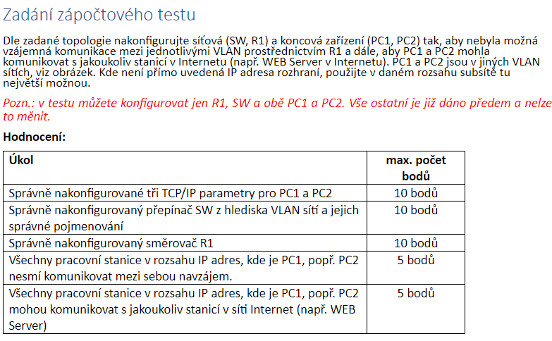
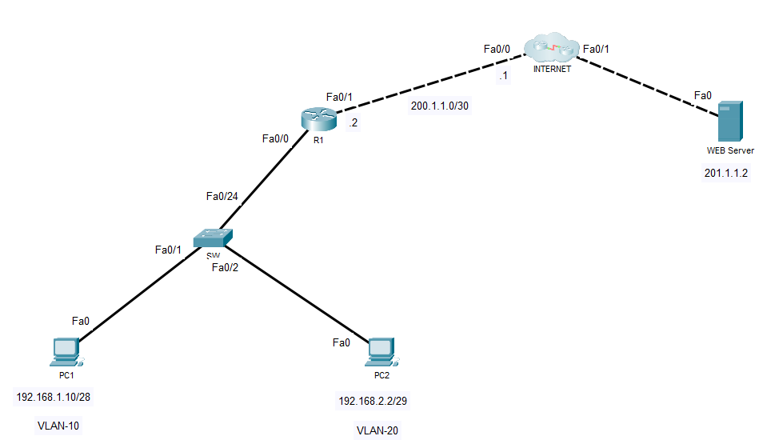

<p align="center">
  
  
</p>

### **2. Konfigurace switch**
1. Otevřete CLI switche a zadejte následující příkazy:
   ```bash
   enable
   configure terminal

   vlan 10
   name VLAN10
   exit

   vlan 20
   name VLAN20
   exit

   interface FastEthernet0/1
   switchport mode access
   switchport access vlan 10
   exit

   interface FastEthernet0/2
   switchport mode access
   switchport access vlan 20
   exit

   interface FastEthernet0/24
   switchport mode trunk
   switchport trunk allowed vlan all
   exit
   ```
2. **Test VLAN**:
   - Připojte PC1 (VLAN 10) a PC2 (VLAN 20) ke switchi.
   - Ověřte příkazem `show vlan brief`, že jsou porty přiřazeny do správných VLAN.

---

### **3. Konfigurace router R1**
1. Otevřete CLI routeru a proveďte základní konfiguraci rozhraní:
   ```bash
   enable
   configure terminal

   interface FastEthernet0/0.10
   encapsulation dot1Q 10
   ip address 192.168.1.14 255.255.255.240
   ip nat inside
   exit

   interface FastEthernet0/0.20
   encapsulation dot1Q 20
   ip address 192.168.2.6 255.255.255.248
   ip nat inside
   exit

   interface FastEthernet0/0
   no shutdown
   exit

   interface FastEthernet0/1
   ip address 200.1.1.2 255.255.255.252
   ip nat outside
   no shutdown
   exit
   ```
2. Nastavte NAT a trasování:
   ```bash
   ip route 0.0.0.0 0.0.0.0 200.1.1.1

   access-list 1 permit 192.168.1.0 0.0.0.15
   access-list 2 permit 192.168.2.0 0.0.0.7

   ip nat inside source list 1 interface FastEthernet0/1 overload
   ip nat inside source list 2 interface FastEthernet0/1 overload
   ```

3. Nastavte ACL pro zamezení komunikace mezi VLAN:
   ```bash
   access-list 100 deny ip 192.168.1.0 0.0.0.15 192.168.2.0 0.0.0.7
   access-list 100 deny ip 192.168.2.0 0.0.0.7 192.168.1.0 0.0.0.15
   access-list 100 permit ip any any

   interface FastEthernet0/0.10
   ip access-group 100 in
   exit

   interface FastEthernet0/0.20
   ip access-group 100 in
   exit
   ```

---

### **4. Konfigurace PC**
1. Otevřete každé PC, přejděte do **Desktop > IP Configuration** a nastavte:
   - **PC1** (VLAN 10):
     - IP Address: `192.168.1.10`
     - Subnet Mask: `255.255.255.240`
     - Default Gateway: `192.168.1.14`
   - **PC2** (VLAN 20):
     - IP Address: `192.168.2.2`
     - Subnet Mask: `255.255.255.248`
     - Default Gateway: `192.168.2.6`

2. **Testování připojení mezi PC**:
   - Otevřete **Command Prompt** na každém PC.
   - Proveďte příkaz `ping`:
     - **PC1 → PC2**: Očekává se, že **ping selže** (kvůli ACL).
     - **PC1 → 200.1.1.2**: Ping by měl projít.
     - **PC1 → 201.1.1.2** (web server): Ping by měl projít.

---

### **5. Test NAT a internetové připojení**
1. Na PC proveďte test přístupu k webovému serveru:
   - Otevřete **Web Browser** na PC.
   - Zadejte IP adresu serveru: `http://201.1.1.2`.
   - Pokud je NAT správně nakonfigurován, stránka se načte.

2. Ověřte NAT na routeru:
   ```bash
   show ip nat translations
   ```
   - Zkontrolujte, zda překlad probíhá mezi privátními a veřejnou IP.

---

### **6. Shrnutí testování**
- **Ping testy**:
  - Mezi PC ve VLAN (10 ↔ 20): Musí selhat.
  - PC1/PC2 → Web server: Musí projít.
- **NAT funkčnost**:
  - Přístup z PC na webový server.
- **Zabezpečení VLAN**:
  - Ověřte, že komunikace mezi VLAN není možná.

---

### **7. Dokumentace**
- Zaznamenejte konfiguraci switche a routeru (příkazy použité výše).
- Vytvořte screenshoty úspěšných a neúspěšných testů.
- Přiložte výstupy z příkazů `show vlan brief`, `show ip nat translations`, a `show ip route`.

Pokud narazíte na problém, dejte vědět, a pomůžu s jeho odstraněním!
